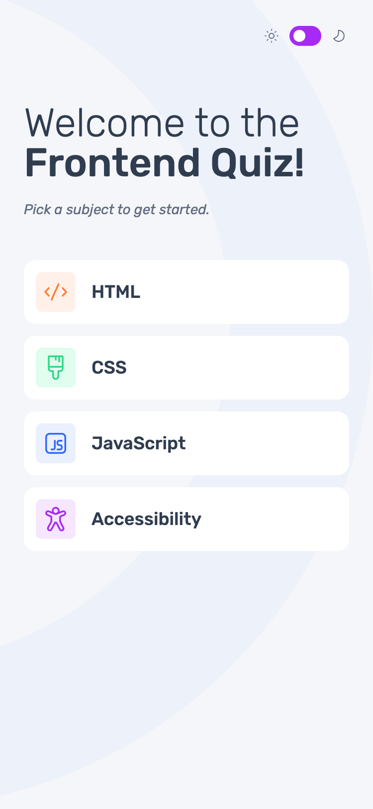
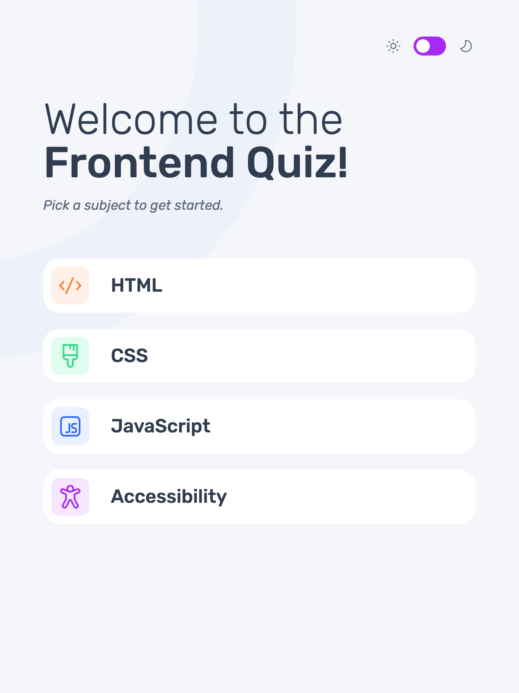
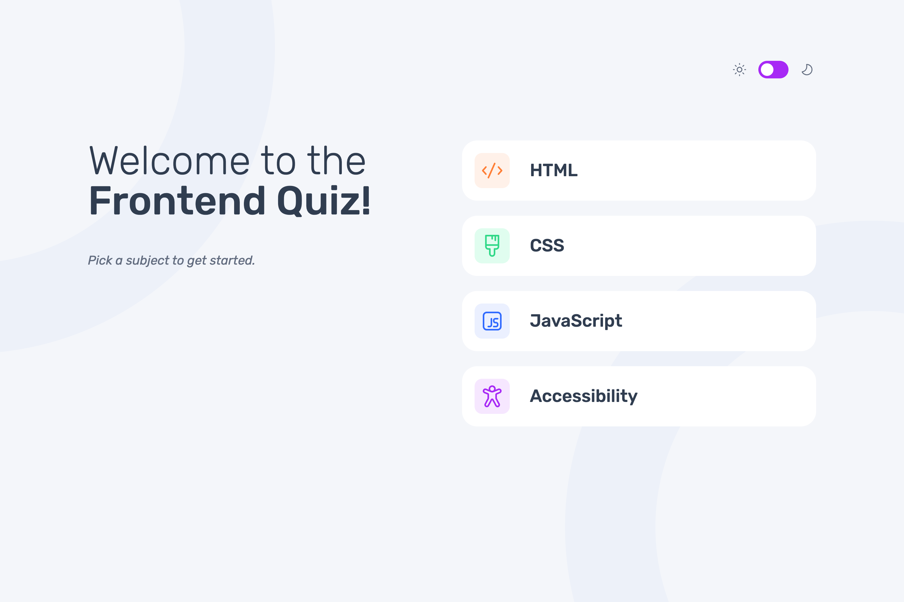
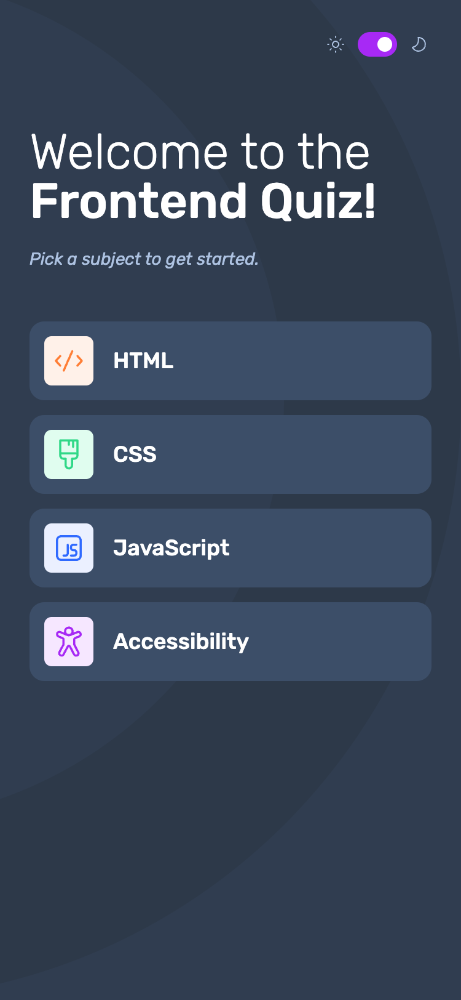
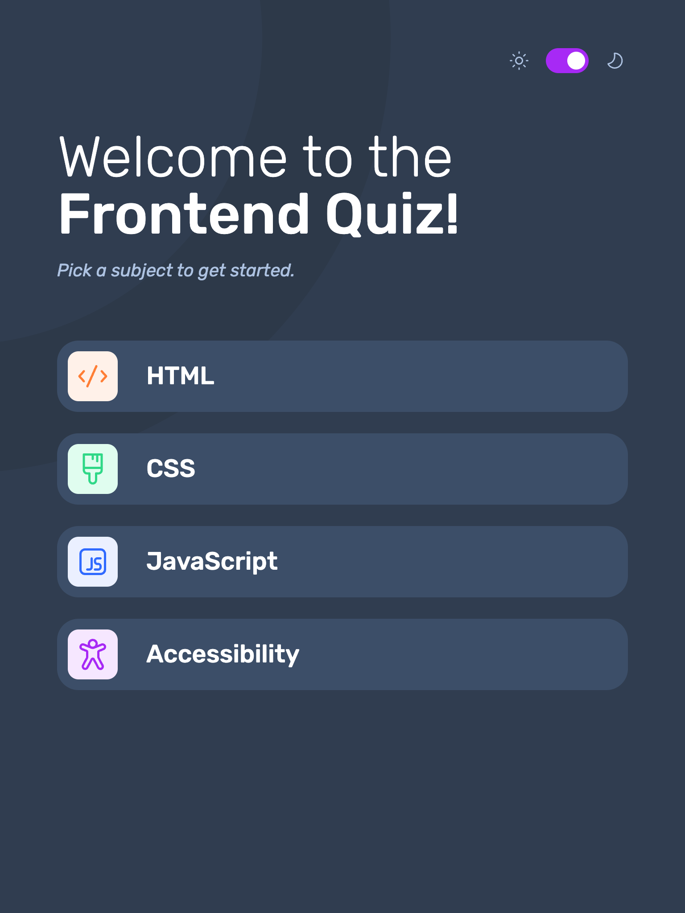
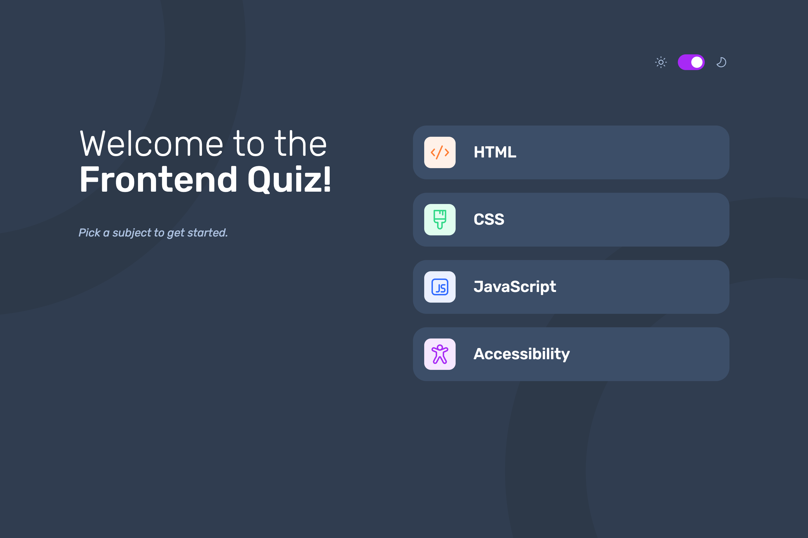

# Frontend Mentor - Frontend quiz app solution

This is a solution to the [Frontend quiz app challenge on Frontend Mentor](https://www.frontendmentor.io/challenges/frontend-quiz-app-BE7xkzXQnU). Frontend Mentor challenges help you improve your coding skills by building realistic projects.

## Table of contents

- [Overview](#overview)
  - [The challenge](#the-challenge)
  - [Screenshots](#screenshots)
  - [Links](#links)
- [My process](#my-process)
  - [Built with](#built-with)
  - [What I learned](#what-i-learned)
  - [Continued development](#continued-development)
  - [Useful resources](#useful-resources)
- [Author](#author)

## Overview

### The challenge

Users should be able to:

- Select a quiz subject
- Select a single answer from each question from a choice of four
- See an error message when trying to submit an answer without making a selection
- See if they have made a correct or incorrect choice when they submit an answer
- Move on to the next question after seeing the question result
- See a completed state with the score after the final question
- Play again to choose another subject
- View the optimal layout for the interface depending on their device's screen size
- See hover and focus states for all interactive elements on the page
- Navigate the entire app only using their keyboard
- **Bonus**: Change the app's theme between light and dark

### Screenshots

|                 Mobile designed at 375px:                 |                 Tablet designed at 768px:                 |                Desktop designed at 1440px:                 |
| :-------------------------------------------------------: | :-------------------------------------------------------: | :--------------------------------------------------------: |
|  |  |  |
|                   Mobile (dark theme):                    |                   Tablet (dark theme):                    |                   Desktop (dark theme):                    |
|   |   |   |

### Links

- Solution URL: [https://github.com/elisilk/frontend-quiz-app](https://github.com/elisilk/frontend-quiz-app)
- Live Site URL: [https://elisilk.github.io/frontend-quiz-app/](https://elisilk.github.io/frontend-quiz-app/)

## My process

### Built with

- Semantic HTML5 markup
- CSS custom properties
- Flexbox
- CSS Grid
- Mobile-first workflow
- BEM naming
- Fluid typography and spacing

### What I learned

- [How can I emulate prefers-color-scheme media query in Chrome?](https://stackoverflow.com/questions/57606960/how-can-i-emulate-prefers-color-scheme-media-query-in-chrome) - A cool trick for the Chrome DevTools to emulate a light or dark theme preference.
- Light and dark themes
- [`innerHTML`](https://developer.mozilla.org/en-US/docs/Web/API/Element/innerHTML) vs. [`textContent`](https://developer.mozilla.org/en-US/docs/Web/API/Node/textContent) vs.
- [Can I escape HTML special chars in JavaScript?](https://stackoverflow.com/questions/6234773/can-i-escape-html-special-chars-in-javascript/6234804#6234804)
- [Remove All Elements with a Class Using JavaScript](https://stackabuse.com/bytes/remove-all-elements-with-a-class-using-javascript/)
- [Convert number to alphabet letter](https://stackoverflow.com/questions/36129721/convert-number-to-alphabet-letter)
- [Get loop counter/index using for…of syntax in JavaScript](https://stackoverflow.com/questions/10179815/get-loop-counter-index-using-for-of-syntax-in-javascript)
- Looking for a CSS only styling of the input range (the progress bar).

### Continued development

Hmm 🤔 ...

Specific areas that the solution should be improved:

- Check the responsiveness of the header height
- Maintain the header height even without a category icon+text showing
- Style the progress bar
- Should the answer choice text be so big? And should it have some line spacing when it goes beyond one line?
- Remove the error message once an answer choice is selected (no need to wait for the submit answer button to be clicked)
- Remove the focus/active/hover state from a button after it is pressed - how to do this?
- Remove use of `innerHTML` in favor of [`insertAdjacentHTML`](https://developer.mozilla.org/en-US/docs/Web/API/Element/insertAdjacentHTML) and related functions. Also remove use of `textContent`? Can affect how a question or answer is displayed. Examples:
  - CSS Q5
- Investigate why (and under what conditions) a correct answer is not marked as correct. Likely involves how the HTML is escaped either in the quiz data or in the HTML document. Seems to be mostly about the escape of single quote marks. Examples:
  - JavaScript Q1, Q7
  - Accessibilty Q2
- Reset the header after a quiz is completed
- Prevent users from selecting a different answer choice after the answer choice has been submitted

More general ideas I want to consider:

- Randomize the order of the answer choices for a particular question?
- Randomize the order of the questions?

### Useful resources

- [MDN Web Docs for CSS](https://developer.mozilla.org/en-US/docs/Web/CSS) - Went here a lot to reference the different CSS properties and the shorthands, and all the great explanations about best practices.
- [MDN Guides](https://developer.mozilla.org/en-US/docs/Learn) - So many resources and nice explanations, including stuff [tutorials specific to Javascript](https://developer.mozilla.org/en-US/docs/Web/JavaScript/Guide).
- [Every Layout](https://every-layout.dev/) - My go to source for thinking about layouts now.
- [The Clamp Calculator](https://royalfig.github.io/fluid-typography-calculator/) - Used for all of fluid typography and fluid spacing calculations.

## Author

- Website - [Eli Silk](https://github.com/elisilk)
- Frontend Mentor - [@elisilk](https://www.frontendmentor.io/profile/elisilk)
